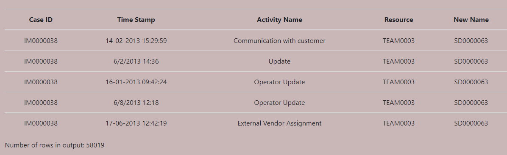

# Interactive LTL Checker in Python

Process Conformance Checking - Project Group 2

### Our project Team
Daniel Henel, Teodora Staneva, Ugo Detaille, 
Mohammed Amine Kooli, 
Vishisht Choudhary

## Task
The objective during this project is to implement an interactive
LTL Checker with which a user can upload, process and filter raw event logs in accordance
with constraints of his or her choice. The constraints can vary in complexity. E.g. the user can drop certain
drop certain columns from the raw data but also filter entries deviating from Linear temporal rules. 

## How to run the application
* Install [git](https://git-scm.com/book/en/v2/Getting-Started-Installing-Git) and [docker]() on your machine
* Clone the reqository 
`git clone https://git.rwth-aachen.de/teodora.staneva99/customizable_interface_ltl_checking.git`
* Go to the ltl_checker directory 
`cd customizable_interface_ltl_checking/ltl_checker`
* Build a docker image 
`docker build -t ltl_checker .`
* Run the docker image 
`docker run -p 5000:5000 -d ltl_checker`
* Open the application in your browser 
`localhost:5000`

## More Information
More information about use cases, features and methodologies during our project can be found in the
following documents: 

* [Project Initiation Documents](./documentation/Project%20Initiation%20Document.pdf)
* [Requirements Engineering Document](./documentation/Requirements%20Engineering.pdf)
* [Phase Review - Sprint 1](./documentation/Phase%20Review%20-%20Sprint%201.pdf)
* [Phase Review - Sprint 2](./documentation/Phase%20Review%20-%20Sprint%202.pdf)

If there are any questions please feel free to get in touch with our communications manager
[Mohamed](amine.kooli@rwth-aachen.de)

## Sprint 1
### DONE:
* Docker configuration, project setup

* The "Upload" page

 

* The "Columns Selection" page

* The "About Us" page

## Sprint 2
### DONE:

* Filters combinations  
Our idea is described in the [/research/filter_combinations.ipynb](./research/filter_combinations.ipynb) file

* Our test data set: [detail_incident_activity.csv](./research/logs/detail_incident_activity.csv)  

* The "Filters Selection" page  

* The initial version of the "Results" page  

* Help User Guide  

## Documentation: 

## Python functions: 

## Sprint 1
* upload()   This function takes in the uploaded file 'file' from the client from the firsth html form (upload.html). Then, the file is converted into a dataframe by calling convertInput() in order to work with it as a pandas dataframe. The function returns the next html page (columns-selection.html) and it returns the dataframe to the js file called columns-selection.js, which requires the conversion of said dataframe into a _json type of file, but only the first five rows are given to the js file, because only those five will be depicted in the second frame as a overview. 

* convertInput()   This function checks the file type of the uploaded file (i.e. .csv or .xes file) and returns the corresponding dataframe by calling the pandas package function pd.read_csv or the pm4py functions pm4py.read_xes and pm4py.convert_to_dataframe.

* Eventlisteners   In the js file, we have also developped multiple Eventlisteners, for example:
        a) The first EventListener handles the "drag part": It checks whether the client drags his mouse over the screen with a file from his directory that the client     wishes to drag and drop into the main box on the upload.html page
        b) The second EventListener handles the "drop part": Once the client has dropped the file into the main box and it has been uploaded, it checks whether at most one file has been uploaded. If not, the alert "You can only upload one file!" appears.

## Sprint 2 
* simplifyExpression()   This function takes a logical formula as a parameter and uses the sympy library to convert the formula into CNF. Further, the clauses of said CNF formula are separated and all those clauses are saved in a list individually. Now, within this list, the literals of all clauses are now saved in the variable clauses_list and are returned (Hence, the function returns a list of literals of a CNF).

* tupleToList()   is a simple helper function that converts a dataset of the type tuple into the type list

* calcResult()   This function takes in 3 parameters: list_of_terms is basically what simplifyExpression() returns (a list of literals), dictionary contains the assignment of the keys (letters in our case) to their respective filter function, raw_log is an event log. The function creates dynamically variables for all keys in the dictionary that the sympy library can work with. The value type is a tuple, with the first component being the filter itself, and the second one the parameters for the filter. Then, the function iterates through the dictionary by the key component and checks what filter function should be called and applies the filter. Note that the basic pm4py filter functions take in the events explicitily, which is hard for us to encode. Rather, we defined helper functions "four_eyes_principle(param1, param2) ..." that are called in calcResult, which separate lists of activities into explicit activities, that are then passed to the pm4py filter functions. For each iteration through the for loop, the filtered raw_log is saved as an array entry, which is then combined to a final output as a dataframe. Note that in the final output all duplicate entries are omitted.

* four_eyes_principle(param1, param2), eventually_follows_2(param1,param2)
eventually_follows_3(param1,param2), eventually_follows_4(param1,param2) : helper functions, see explanation above.

* renameColumns(columns_to_drop, columns_to_rename)   This function takes the user input from the columns selection page, where one can rename columns and select columns to drop. The output of this function is a dataframe with all the user's selections i.e. where all unwanted columns are omitted from the dataframe or renamed. 

Parameters:  
`columns_to_drop`: This parameter is a list of the column names from the raw log which should be excluded from the dataframe that will be filtered

`columns_to_rename`: This parameter is a dictionary with a mapping of original column names and the intended name the user wants to change it to. 

* getActivites(df) : returns the unique set of all activites of the dataframe passed to it.

Parameters:  
`df`:This parameter is the event_log from which we want to extract a list of activities

 ## Sprint 3

 ## LTL Filters

 * four_eyes_principle(df,activites) 
 This function applies the four eyes principle filter to the data frame using the predefined function from the pm4py library.  

  * eventually follows(df,activites) 
 This function applies the eventually follows filter to the data frame using the predefined function from the pm4py library.  

  * attribute_value_different_persons(df,activites) 
 This function applies the attribute value different persons filter to the data frame using the predefined function from the pm4py library.  

 Parameters:  

 `df`: This is the dataframe/event _log which needs to be filtered  

 `activities`: This is a list of the activities that are to be viewed as arguments of the filter functions. For example: for eventuallyfollows(A,B) would be executed by passing the list [A,B] as the activities parameter

## JS functions: file

* changeCloudColor() On the first html page (upload.html) we have designed a cloud that according to its color specifies the (in)correct state of the uploaded file. In case that the uploaded file is either a .csv or a .xes type of file, the cloud will change its color to green, otherwise to red. In case the uploaded file is not of the right type, an alert notification appears stating "The file should be in 
.csv or .xes format". 

* loadDataFromFile()  The parameter "data" is given to the function. "data" contains the first five entries of the event log from the uploaded file and the header. Then, an "empty table" is declared in the columns-selection.html file, which later will contain the overview of the first five columns. Now, the function converts the dataframe we have generated earlier into a .html readable format. The components of the table are mainly created by usage of the js function "createElement". Through a for-loop, the rows and columns are created iteratively: First, the first row is declared as the header. The for loop also generates the specific table elements (e.g. "td", "tr", "th"...). The function also contains the definition of text input fields to change a column's name. Yet, that functionality has not been implemented yet.

